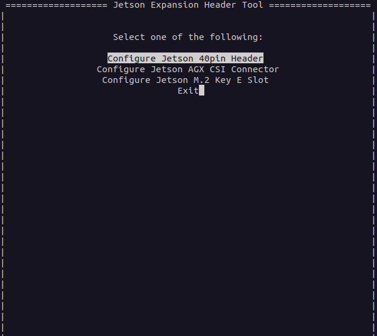
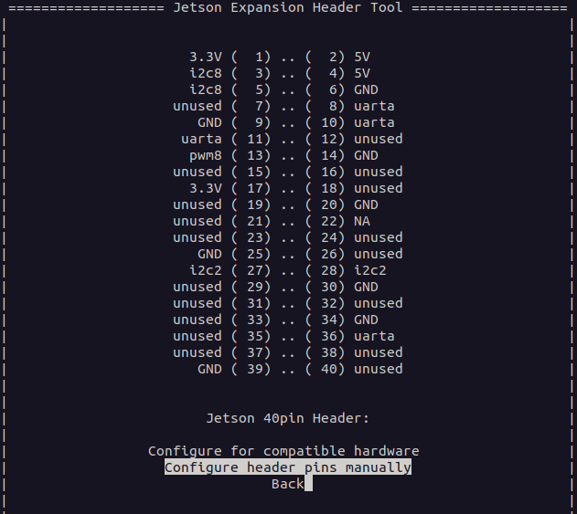
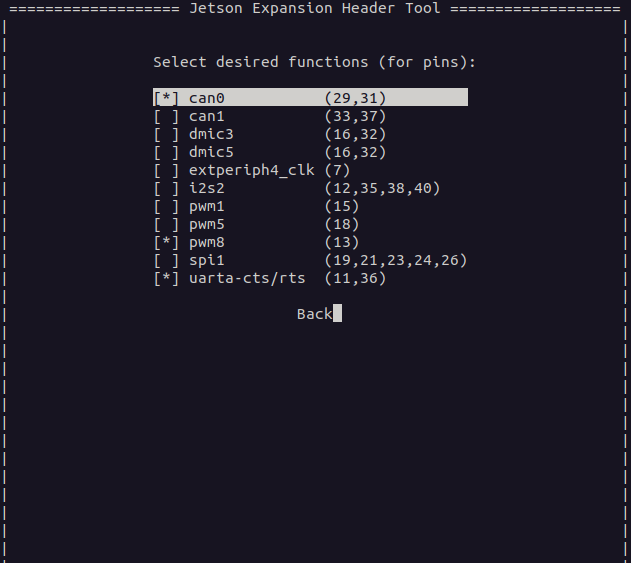
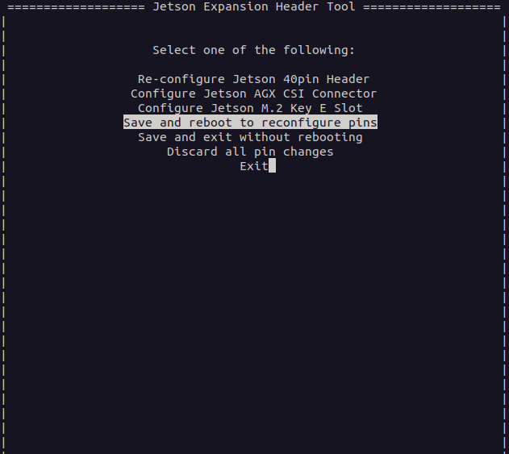

# R2 Jetson Setup

## System Update

    sudo apt install software-properties-common
    sudo add-apt-repository universe
    sudo apt update
    sudo apt upgrade -y

## Install ROS

    sudo apt update && sudo apt install curl -y
    export ROS_APT_SOURCE_VERSION=$(curl -s https://api.github.com/repos/ros-infrastructure/ros-apt-source/releases/latest | grep -F "tag_name" | awk -F\" '{print $4}')
    curl -L -o /tmp/ros2-apt-source.deb "https://github.com/ros-infrastructure/ros-apt-source/releases/download/${ROS_APT_SOURCE_VERSION}/ros2-apt-source_${ROS_APT_SOURCE_VERSION}.$(. /etc/os-release && echo ${UBUNTU_CODENAME:-${VERSION_CODENAME}})_all.deb"
    sudo dpkg -i /tmp/ros2-apt-source.deb

    sudo apt update
    sudo apt install ros-humble-ros-base
    sudo apt install ros-dev-tools

    sudo rosdep init
    rosdep update

## ZED Install

    wget https://download.stereolabs.com/drivers/zedx/1.4.0/R36.4/stereolabs-zedlink-duo_1.4.0-LI-MAX96712-L4T36.4.0_arm64.deb
    wget https://download.stereolabs.com/zedsdk/5.2/l4t36.4/jetsons

    sudo apt install zstd

    chmod +x jetsons
    ./jetsons

    sudo dpkg -i stereolabs-zedlink-duo_1.4.0-LI-MAX96712-L4T36.4.0_arm64.deb
    sudo apt install -f

## Build Everything

    source /opt/ros/humble/setup.bash

    mkdir -p ~/r2_ws/src
    cd ~/r2_ws/src
    git clone --recurse-submodules git@github.com:davesarmoury/R2Prime.git
    cd ..
    rosdep install --from-paths src --ignore-src -y

## CAN

    sudo /opt/nvidia/jetson-io/jetson-io.py

    sudo ip link set can0 up type can bitrate 1000000

## Spotify

    curl --proto '=https' --tlsv1.2 -sSf https://sh.rustup.rs | sh
    cargo install spotifyd --locked

    spotifyd -d R2D2

## ODrive

    python3 -m pip install odrive --upgrade
    pip3 install pyusb libusb pyelftools
    odrivetool install-bootloader
    odrivetool new-dfu
